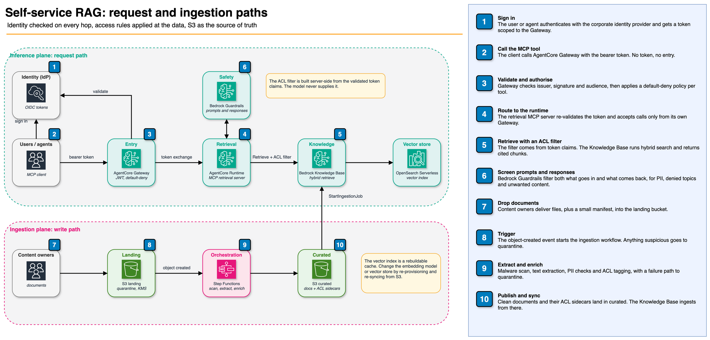
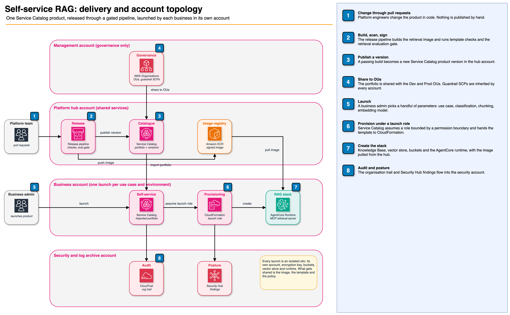
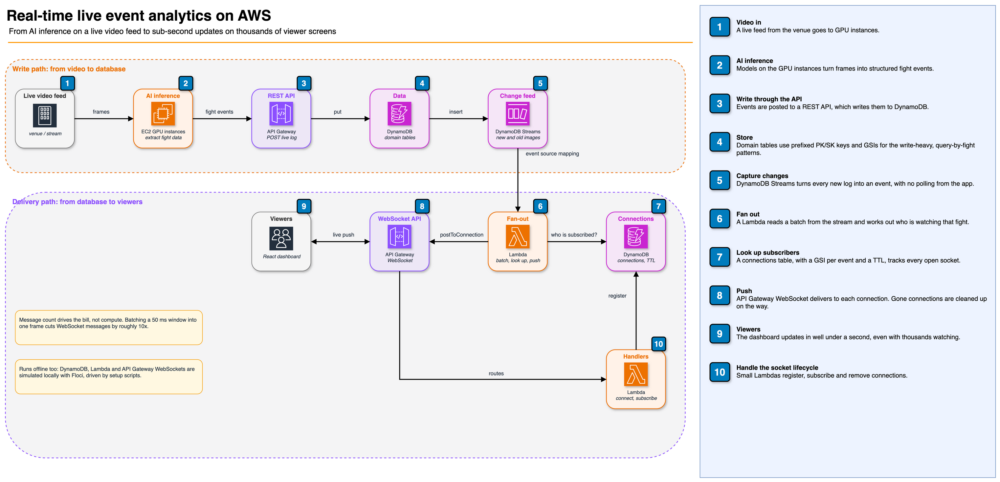
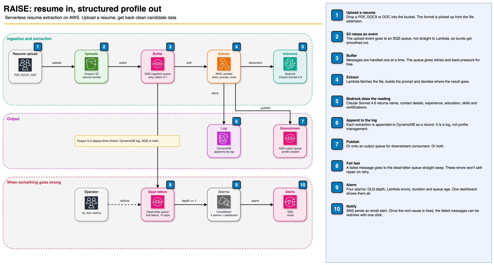
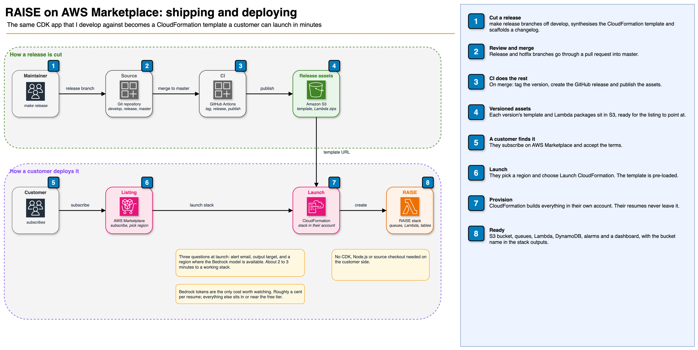
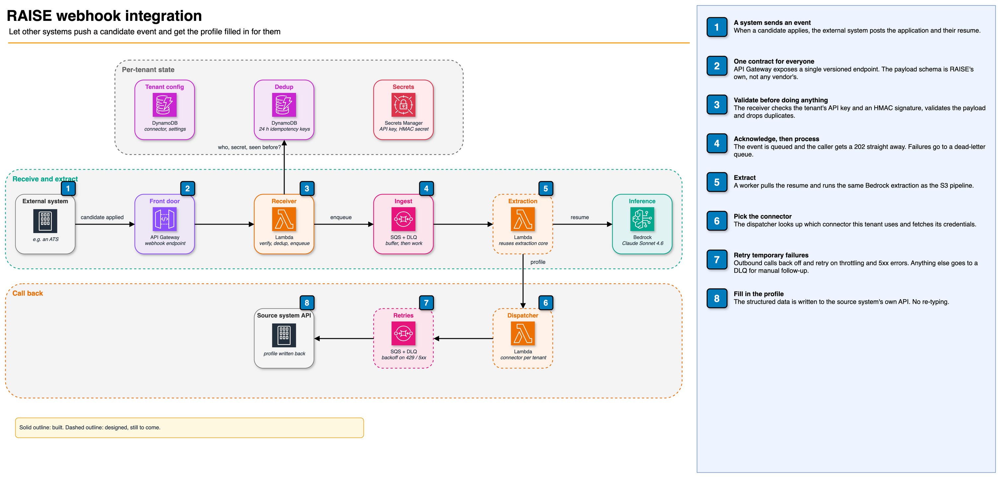

## Hi, I'm Donald 👋

I'm a solutions architect in Midrand, South Africa, and I've spent 10+ years building systems for banks, insurers, fintechs and, more recently, a sports-tech company. For the last few years most of that has been on AWS. It started with migrations and infrastructure automation, and lately it's been generative AI platforms and real-time data streaming pipelines.

## What I'm working on 🔭

### Self-service RAG for businesses

Several businesses want to ask questions of their own documents, and none of them wants to build the plumbing or explain to Security how it works. So the whole thing is packaged as an **AWS Service Catalog product**. A business admin picks a handful of options (data classification, chunking, embedding model) and gets an isolated stack in their own AWS account:

- an ingestion pipeline that scans, extracts and tags documents,
- an Amazon Bedrock Knowledge Base on OpenSearch Serverless,
- a retrieval MCP server on Bedrock AgentCore Runtime, reachable only through AgentCore Gateway.

It's all reusable CDK, so onboarding a new business means launching the product.

The main design decisions:

- **Identity on every hop.** An agent chains calls, so one unauthenticated hop breaks the whole trust chain. The token is checked at the Gateway and again at the runtime, and the runtime only accepts calls from its own Gateway.
- **Authorise at the data, not just at the door.** A valid caller isn't entitled to every document. The access filter is built server-side from the validated token claims, and the model never gets to supply it.
- **S3 is the source of truth, the vector index is a cache.** Embedding models and vector stores change. If the index can be rebuilt from S3, changing either is a re-provision, and deleting a document has a clear answer.
- **One account per business.** The image, the template and the policy are shared. The data is not.

Getting the delivery side right took as much thought as the runtime. Each launch runs under a launch role bounded by a permission boundary, so business admins don't need CloudFormation rights, and the guardrail SCPs come along with the account's OU.

Releases are gated on retrieval quality as well as on template checks. A RAG regression is silent because it looks like a fluent, wrong answer, so the release pipeline runs an evaluation against a golden dataset and blocks a new product version when the results drop.

### Live event analytics for a sports-tech company

The client runs AI models over live combat sports video, and they wanted viewers to see the numbers as the fight happens. The pipeline was designed end to end: GPU instances turn video into fight events, the events land in DynamoDB, and a stream-driven fan-out pushes them over WebSockets to a React dashboard. Thousands of concurrent viewers, updates in well under a second. On paper a warm path is 150 to 350 ms.

The data layer also moved from MongoDB to DynamoDB, with the domain tables modelled using prefixed PK/SK keys and GSIs so the write-heavy paths and query-by-fight reads both stay cheap.

A few findings from the design work:

- **WebSocket messages are the main cost.** Lambda and DynamoDB Streams cost very little. Sending every log entry to every viewer is what adds up. On my estimates (ten events a month, 1,000 viewers) that's around $150, and batching a 50 ms window into one frame brings it to roughly $16.
- **Stale connections need handling.** Browsers close without saying goodbye, and API Gateway drops sockets after two hours regardless. The fan-out deletes a connection the moment it gets a 410, the connections table has a TTL to match the two-hour limit, and the client reconnects with backoff.
- **Local Environment Parity.** On a developer's laptop, the AWS services the flow depends on (DynamoDB, Lambda, API Gateway v2 WebSockets) are simulated with Floci and set up by scripts, so the whole flow can run offline at no cloud cost.

### RAISE: turning resumes into data

[RAISE](https://raise.awesomatic.co.za) (Resume Analysis & Inference Serverless Engine) is a serverless product that turns a resume, in PDF, DOCX or DOC format, into a structured candidate profile covering contact details, experience, education, skills and certifications. Data extraction is done by Claude Sonnet 4.6 on Amazon Bedrock, and the pipeline is built from managed AWS services (S3, SQS, Lambda and DynamoDB), which keeps running costs low and operations light.

Two design decisions are worth explaining. Uploads go to an SQS queue first, and not straight to Lambda, so a burst of resumes gets smoothed out instead of throttled. And a failed message goes to the dead-letter queue on the very first failure. The usual causes (Bedrock access denied, an IAM misconfiguration) won't self-repair on retry, so retrying only delays the alert. Four CloudWatch alarms cover DLQ depth, Lambda errors, Lambda duration and queue age. Once the root cause is fixed, recovery takes one click on "Start DLQ redrive" in the SQS console.

Where the extracted profiles go is a deploy-time choice: DynamoDB, an output queue for downstream systems, or both. DynamoDB currently works as an append-only log of extractions. It doesn't offer profile management.

#### 1. On AWS Marketplace

RAISE is listed on AWS Marketplace, so a customer can run it in their own account without touching a toolchain. They subscribe, pick a region, and choose *Launch CloudFormation*. It asks three things (an alert email, where output should go, and a region where the Bedrock model is available) and a couple of minutes later the stack is up. Their resumes stay in their account the whole time.

The other half is getting from a CDK app to a template someone else can launch. `make release` cuts the release branch, synthesises the CloudFormation template and scaffolds the changelog. Merging to master lets CI tag the version, create the GitHub release and publish the assets.

On cost, Bedrock tokens are the only line worth watching. It comes to roughly a cent per resume, and everything else sits in or close to the free tier.

#### 2. Webhook integration (in progress)

Dropping a file into S3 works for a person or a pipeline. It doesn't work for something like an applicant tracking system, which wants to say "this candidate just applied" and have their profile filled in without anyone retyping it. So an inbound webhook is being added.

The design:

- **One generic contract.** A single versioned endpoint with RAISE's own payload schema. Each target system gets a connector; the receiver never special-cases any of them. The OpenAPI document comes first, so integrators can build against the contract while the implementation is still under way.
- **Acknowledge first, process later.** The receiver checks the tenant's API key and an HMAC signature over the raw body, validates the payload, drops duplicates and queues the event, then returns a 202. Extraction and the callback happen behind the queue, with retries and dead-letter queues at each hop.
- **Keys are never stored raw.** The API key is hashed and compared in constant time, and each tenant gets their own secret.
- **Deployed separately.** The webhook stack and the S3 pipeline never deploy together, so Marketplace customers can't end up with a stack they didn't ask for.

## 📫 Let's connect
- [Email](mailto:donald@awesomatic.co.za)
- [LinkedIn](https://www.linkedin.com/in/donald-siziba-35603322/)
- [Medium](https://medium.com/@donaldsiziba)

<!--
**donaldsiziba/donaldsiziba** is a ✨ _special_ ✨ repository because its `README.md` (this file) appears on your GitHub profile.
-->
