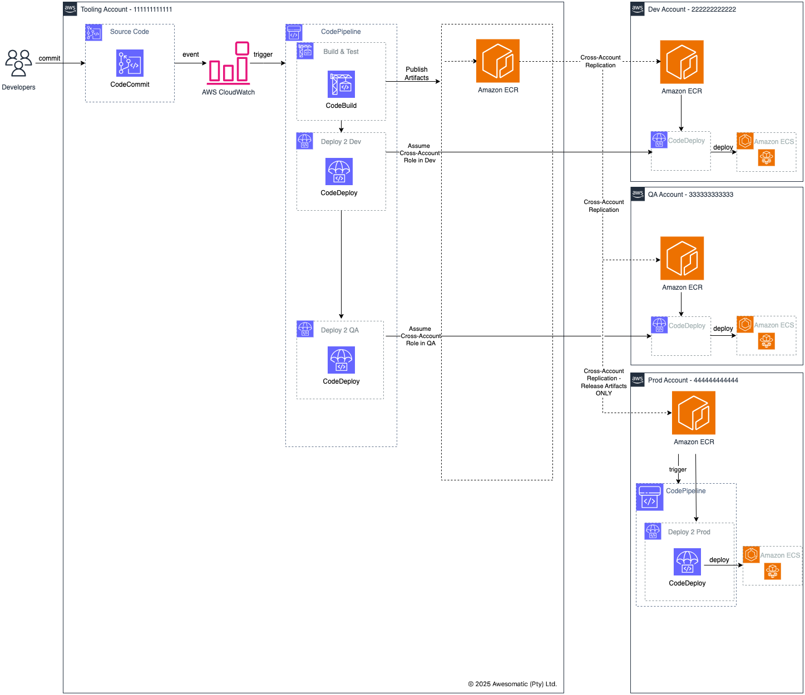

## Hi there 👋

I am an experienced Solutions Architect with a strong background in cloud migrations, infrastructure automation, developing highly available, scalable and fault-tolerant solutions on-premise and across multi-account AWS environments.

## Current Projects 🔭 
I’m currently working on AWS workload migrations, with most deployments following the standard 3-tier architecture -  application and data layers fronted by an internet-facing web application. The infrastructure, including the CI/CD pipelines, are provisioned using AWS CloudFormation - strictly ❌ **NO ClickOps**.

### Application Infrastructure Architecture 🏗️
  
Application Infrastructure Architecture

The application infrastructure consists of the following:
- A highly available architecture that spans 2 Availability Zones (AZs).
- A Virtual Private Cloud (VPC) configured with private and public subnets, according to AWS best practices.
- Managed Network Address Translation (NAT) gateways in the public subnets to allow outbound internet access for resources in the application's private subnets.
- AWS Simple Storage Service (S3) for website hosting.
- AWS Content Delivery Network (CDN) to distribute static and dynamic content.
- In the private subnets:
  * Amazon Elastic Container Service (ECS) tasks running with AWS Fargate behind the Application Load Balancer (ALB).
  * Implement Auto-Scaling to automatically adjust the number of ECS instances in response to traffic demands to ensure the application can handle load spikes without manual intervention.
  * RDS Postgres Database with a primary and secondary instance. Set up Multi-AZ deployments for databases to keep the data synchronized across different locations.
- Secrets from AWS Secrets manager to store database credentials. 
- Parameter Store to provide secure, hierarchical storage for configuration data management.
- AWS Certificate Manager (ACM) uses a certificate for the custom domain name on the ALB.
- Amazon Route 53 alias record, which is required for the custom domain name.
- AWS Web Application Firewall (WAF) to protect the web application from common web exploits that could affect application availability, and compromise application security.
- AWS Shield to prevent Distributed Denial of Service (DDos) attacks.
- AWS Opensearch to offer rich full-text search and navigation experience.

### CI/CD Pipelines 🔁
An integral part of DevOps is adopting the culture of [continuous integration and continuous delivery](https://en.wikipedia.org/wiki/CI/CD) (CI/CD), where every code change seamlessly progresses through automated pipelines - from build and test phases to deploying applications from development all the way through to production environments.

#### Frontend Application CI/CD Pipeline
  
Frontend Application CI/CD Pipeline

#### Backend Application CI/CD Pipeline
  
Backend Application CI/CD Application

1. A commit to the CodeCommit applicaiton repository triggers the Codepipeline through a Cloudwatch event.  
2. The CodePipeline downloads the code from the CodeCommit repository, kicks-off the build, test and packaging phases.The build artifact is published to an S3 bucket or an AWS Elastic Container Registry (ECR) for the frontend and backend applications respectively.  
3. The pipeline triggers a deployment to the Dev environment using CodeDeploy.  
4. Subsequent deployments to the QA or UAT environments are done through manual approvals.  
5. When the release process is run and completed, the release tagged artitacts are replicated to the production for their eventual release via CodeDeploy.  

> NOTE:  
> Release artifacts will be replicated to the production account and in-turn deployed from the production account. This approach 
> enhances security by limiting access to production resources and ensures only approved artifacts are deployed to
> production.

<!--
**donaldsiziba/donaldsiziba** is a ✨ _special_ ✨ repository because its `README.md` (this file) appears on your GitHub profile.

Here are some ideas to get you started:

- 🔭 I’m currently working on ...
- 🌱 I’m currently learning ...
- 👯 I’m looking to collaborate on ...
- 🤔 I’m looking for help with ...
- 💬 Ask me about ...
- 📫 How to reach me: ...
- 😄 Pronouns: ...
- ⚡ Fun fact: ...
-->
